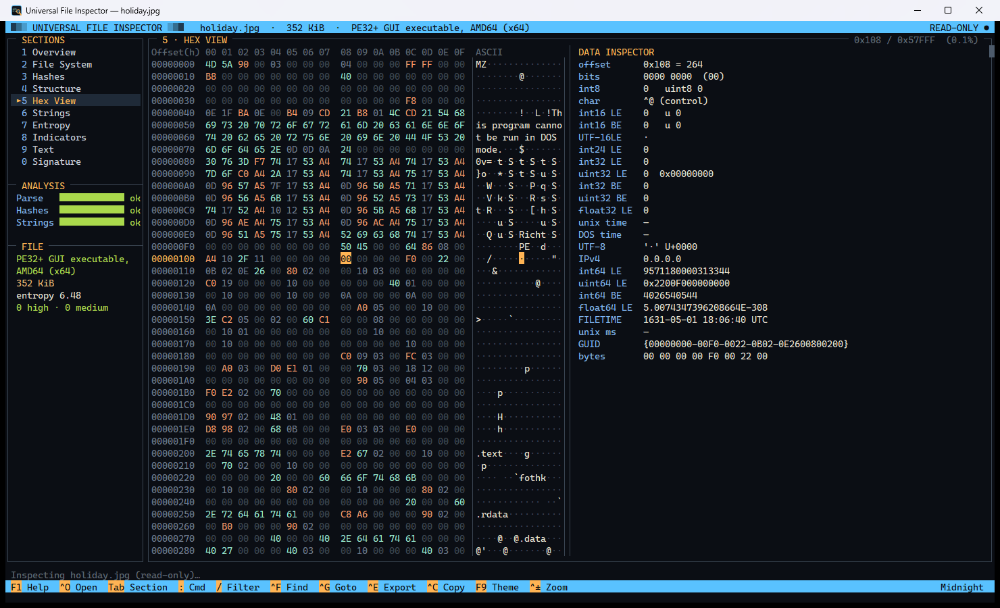
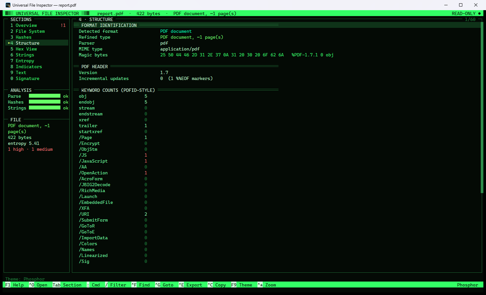

# Universal File Inspector

A terminal-style Windows app that lets you inspect **any file, down to the last bit and byte, without ever executing it**.

Drag a file onto the window (or onto the `.exe`) and you get a full breakdown: identity, file-system and NTFS metadata, hashes, a parsed view of the internal structure, a hex editor-style viewer with a data inspector, strings, an entropy map, indicators of compromise, embedded files, and digital signatures.




## Safety model

The inspector treats every file purely as **data**:

- The file is opened with `FileAccess.Read` and shared read/write/delete. It is never written to, locked, or modified.
- Nothing is executed, loaded as a library, mapped as an image, previewed by a shell handler, or opened with its associated program.
- No thumbnails, icon handlers, or preview handlers are invoked. Every parser is plain managed C# code that reads bytes.
- Nothing is uploaded or looked up online. Signature checks run offline (`WinVerifyTrust` with revocation checks disabled and cache-only URL retrieval). Hash look-up links (VirusTotal and others) are only *displayed*, never contacted.
- File timestamps are captured **before** the file is opened.
- Drag & drop is the most isolated way to open a file. Ctrl+O uses the standard Windows file picker, which (like Explorer) may render thumbnails of the files it lists.

Even so, treat unknown files with care. A read-only tool can't protect you if you later open the file somewhere else.

## Sections

| Key | Section | What you get |
|---|---|---|
| `1` | **Overview** | Detected type (magic-based, not extension-based), extension mismatch check, key hashes, entropy, and a ranked list of findings (high / medium / info). |
| `2` | **File System** | Full and resolved path, NTFS file ID / MFT record, hard-link count, all timestamps (captured before opening), size on disk and slack, attributes, **alternate data streams**, **Mark-of-the-Web** (`Zone.Identifier`: download URL and referrer), owner, DACL / SDDL, volume info, and file-name tricks (RTLO, double extensions, padding). |
| `3` | **Hashes** | CRC-32, Adler-32, FNV-1a 64, MD5, SHA-1, SHA-256, SHA-384, SHA-512, SHA3-256, SHA3-512, imphash (PE), and hashes of the first and last 4 KiB. |
| `4` | **Structure** | A format-specific deep parse. See the format list below. |
| `5` | **Hex View** | Virtual hex/ASCII viewer that handles any file size, plus a **data inspector** showing the value at the cursor as bits, int8 to int64 (LE/BE), float32/64, Unix / DOS / FILETIME timestamps, UTF-8/16, GUID and IPv4. It also shows which PE section or region the cursor is in. |
| `6` | **Strings** | ASCII and UTF-16LE strings with offsets. Filterable, and Enter jumps to the string in the hex view. |
| `7` | **Entropy** | Shannon entropy, chi-square, arithmetic mean, Monte-Carlo π, serial correlation (like `ent`), byte classes, longest run, a block **entropy map**, and a full 256-value histogram. |
| `8` | **Indicators** | URLs, IPs, domains, e-mails, paths, registry keys, crypto wallets / .onion, Base64 blobs (decoded and identified), suspicious Windows APIs grouped by behaviour, script / LOLBin keywords, and **embedded file signatures** (carved PE, ZIP, PDF, images, OLE, etc. at non-zero offsets). |
| `9` | **Text** | The file as text with line numbers and encoding detection. Binary files get a printable rendering. |
| `0` | **Signature** | Authenticode trust verdict, **Windows catalog signatures** (used by system files), and a full PKCS#7 dump: signer, digest, signing time, RFC 3161 timestamp, nested signatures, and every certificate in the chain. |

## Supported formats (structural parsers)

- **Executables:** PE32/PE32+ (DOS header and stub, Rich header, COFF, optional header, checksum verification, data directories, sections with entropy and MD5, imports, delay imports, exports, resources, version info, manifest, debug/PDB, TLS callbacks, load config, relocations, .NET CLR metadata, overlay detection); ELF (headers, segments, sections, dynamic libs, symbols, build-id); Mach-O and universal binaries; Java `.class`; WebAssembly.
- **Archives:** ZIP / ZIP64 (with OOXML, ODF, EPUB, JAR, APK, IPA, APPX/MSIX, NuGet and VSIX sub-type detection, document metadata, **external template injection**, macro detection, zip-slip and zip-bomb checks), GZIP (streams the content and lists `.tar.gz` entries), TAR, 7-Zip, RAR 4/5, CAB.
- **Documents:** PDF (pdfid-style keyword counts, Info/XMP metadata, JavaScript, OpenAction, Launch, URIs, embedded files, incremental updates, trailing data); OLE2/CFB (Word/Excel/PowerPoint 97-2003, **MSI**, **Outlook MSG** headers/body/attachments, summary information, **VBA macro source extraction**); RTF detection.
- **Images:** JPEG (segments, **EXIF including GPS coordinates**, XMP, ICC, comments, data after EOI), PNG (chunks with CRC check, text chunks, eXIf, APNG, data after IEND), GIF, BMP, ICO/CUR, TIFF / camera RAW IFDs, WebP.
- **Media:** RIFF (WAV, AVI, WebP, ANI), ISO-BMFF (MP4, MOV, HEIC, AVIF, 3GP: box tree, durations, codecs, iTunes tags, **GPS location**), MP3 (ID3v1/v2 and MPEG frame), FLAC.
- **Windows artifacts:** LNK shortcuts (target, arguments, **machine ID and MAC address** from tracker data, padding and disguise tricks), Registry hives, ISO 9660/Joliet disc images (full directory listing).
- **Data:** SQLite (header, schema, row counts), X.509 certificates (DER/PEM), private-key detection, JSON (validation and structure), XML (well-formedness, entity/XXE flag), HTML (scripts, forms, smuggling patterns), scripts (PowerShell `-EncodedCommand` decoding, download-and-execute, Defender tampering, obfuscation).
- Dozens of further formats are **identified** by signature (7z, xz, zstd, VHD(X), VMDK, WIM, EVTX, PCAP, fonts, and more).

## Keys

| Key | Action |
|---|---|
| Drag & drop / `Ctrl+O` | Open a file |
| `1`–`9`, `0`, `Tab`, `Shift+Tab` | Switch section |
| `↑ ↓ PgUp PgDn Home End` | Navigate (hex view: move by byte and row; `Ctrl+Home/End` for file start/end) |
| `← →` | Horizontal scroll (hex view: previous / next byte) |
| `Enter` / double-click | Jump from a line to its offset in the hex view |
| `:` | Command line |
| `/` | Filter the current view |
| `Ctrl+F`, `F3` / `n` | Find (UTF-8), find next |
| `Ctrl+G` | Go to offset |
| `Ctrl+E` | Export a full text report |
| `Ctrl+C` / `Ctrl+Shift+C` | Copy view / current line |
| `F9` | Cycle theme: Midnight, Phosphor (green CRT), Amber, Solar Light |
| `Ctrl +/-`, `Ctrl+Wheel` | Zoom |
| `F5` | Re-analyze |
| `F1` / `?` | Help |

### Commands

```
:open <path>         :goto 0x1F4 | 500 | 1F4h | +0x10 | -16 | end | 50%
:find <text>         :findu <text> (UTF-16)      :findhex 4D 5A 90 00
:filter <text>       :export [path]              :copy
:theme <name>        :font <size>                :reload     :quit
```

## Headless report

```
UniversalFileInspector.exe --report <file> [<output.txt>]
```

This writes the complete analysis (every section, plus the first 1 KiB of hex) to a text file without opening a window. It's useful for scripting and triage.

## Building

Requirements: Windows 10/11 and the [.NET 10 SDK](https://dotnet.microsoft.com/download).

```powershell
# run from source
dotnet run -c Release

# produce the single self-contained EXE in .\publish
.\build.ps1
```

`build.ps1` publishes a single-file, self-contained `win-x64` executable (about 100 MB). It needs no .NET runtime on the target machine. `.\build.ps1 -FrameworkDependent` builds a sub-1 MB EXE instead, which needs the .NET 10 Desktop Runtime installed.

> **Smart App Control:** single-file *compression* is intentionally disabled. On PCs with Smart App Control enabled, Windows blocks unsigned EXEs that have a compressed (packed) payload, but it allows the uncompressed bundle. Like any unsigned download, the EXE may still show a SmartScreen prompt on other machines until it builds reputation or is code-signed.

## Project layout

```
src/
  Program.cs              entry point (+ --report mode)
  Core/                   ByteSource (read-only random access), Detect (magic signatures),
                          Stats (hashes + ent-style statistics), Scanner (strings, carving, IOCs), Doc model
  Parsers/                PE, ELF, Mach-O, archives, images, media, documents, misc
  Analysis/               Session (background orchestration), FsInfo (NTFS/ADS/ACL), SignatureInfo (Authenticode)
  UI/                     MainForm (custom-painted terminal grid), Theme
assets/app.ico            application icon (generated by tools/make-icon.ps1)
```

## License

MIT. See [LICENSE](LICENSE).
